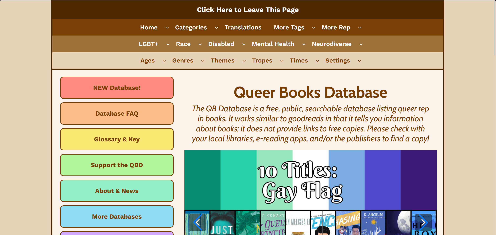
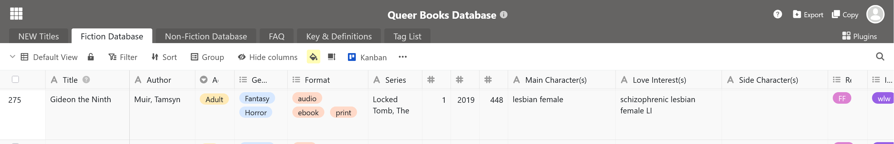
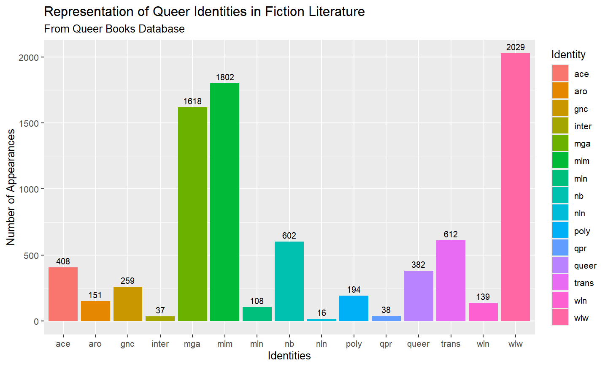
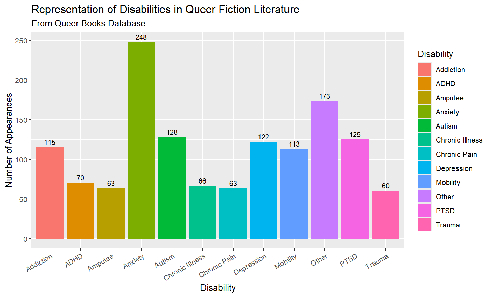

# Intersecting Stories: Data on the Importance of Queer Disability Representation in Literature

_Justin Maynard_

### Visibility

It can be a struggle to pick out what book to read next, to find one that will satisfy your specific tastes and needs. As a neurodivergent queer person, it’s doubly hard to find a book where I can truly feel myself between the pages, to find representation and visibility in the stories. Granted, that isn’t always what I’m in the mood for. But no one should have that option denied from them. 

Queer and disability visibility is incredibly important. Humans look to media and literature for representation and role models, especially during their formative years. Being able to see yourself in a book is a validating and empowering experience, especially for those who are marginalized and made invisible by mainstream society. Representation helps to normalize the experience of queer and disabled/neurodivergent individuals, exposing readers to positive representations and challenging dominant assumptions and stereotypes (Nikki, 2024). There are boundless examples of cisgender, straight white male protagonists, with stories centering around marginalized identities feeling like a drop in the sea. Yet the amount of these stories has been rapidly increasing in recent years, paving the way for new voices to be heard. 

So, how does someone go about finding these diverse new stories? Goodreads is one of the most popular options, having a comprehensive tagging system and nearly all books you can think of. Yet personally its search features leave a lot to be desired (e.g. not being able to search by multiple tags at once). And LGBTQ Reads, while certainly a valuable resource, isn’t as comprehensive as I would like. 

In trying to understand the prevalence of sources for queer and disabled representation in literature, I found the data and its accessibility to be severely limited. The same can be said for data on queerness and disability/neurodivergence as well. These demographics remain understudied and underserved, making efforts to put the pieces together all the more valuable. 

### The Database

Enter the Queer Books Database. 

The [Queer Books Database](https://qbdatabase.wpcomstaging.com/) is a large and accessible database that collects information on books with queer representation. It also features an accompanying website, serving as a way to allow users to locate books with specific representation and themes, with pages listing all books containing such tags. This website portion has similar functionality to LGBTQ Reads. 

Yet what truly sets the Queer Books Database apart is in its name: [the database](https://cloud.seatable.io/dtable/external-links/custom/queerbooksdatabase/?tid=1T68&vid=0000). The database is split into 3 sections: New Titles, Fiction, and Nonfiction. The Fiction Database, with 5,420 records at the time of writing, is what I’ll be focusing on here. The database lists each book’s title, author, genre, publication year, the identities and relationships represented in the book, and a whole lot more. While this database is focused specifically on queer identities, it does also contain information on other forms of representation, such as disability, neurodivergence, and ethnicity, along with content warnings and themes. 

I’ll use Tamsyn Muir’s Gideon the Ninth as an example. It has the genre tags of Horror and Fantasy, the relationship tag of *FF* (female/female), the identity tag of *wlw* (woman-loving-woman), and the neurodivergence tag of *schz* (schizophrenia). The database makes use of many different tags and abbreviations reminiscent of those used to tag fanfiction, and while not all of their meanings may be immediately obvious, there is a helpful “[Key & Definitions](https://cloud.seatable.io/dtable/external-links/custom/queerbooksdatabase/?tid=DH8I&vid=0000)” page. In relationship and identity tags, “F” or “W” is typically used to refer to female/woman, “M” is used for male/man, “N” or “nb” is used for nonbinary, and “mga” refers to multi-gender attracted. 

Something that I’ve found to be very impressive is that the Queer Books Database appears to have been created, updated, and maintained by a single individual. The creator posts occasional updates on their “[About & News](https://qbdatabase.wpcomstaging.com/about/)” page, and typically aims to update the database once a month. The data for the Queer Books Database appears to have been collected through “searching for queer representation across many different sites that promote new releases, as well as archives and other databases to search for previously published titles” (“Frequently Asked Questions”, n.d.). Being the passion project of one person, it’s obvious that this database wouldn’t feasibly be able to include all queer books, so the creator needs to make decisions on what books to include and exclude.

>“This is a curated database intended to help users find positive representation or at least make an informed decision on whether they wish to read materials that may be dated or contain some offensive content. It is not an archive of every book that has queer rep or discusses queer topics” (“Frequently Asked Questions”, n.d.).

The choice of which books to include is significant, given that the creator must choose to prioritize certain books with the limited time that they have. As such, this database isn’t fully representative of the entirety of queer literature, but can provide valuable information and suggestions on queer literature, being the largest database of its kind that I could find. 

The creator also needs to interpret the information provided and the opinions of others online about what representation is present within the books, as this information is not always clearly outlined by authors and publishers. This can lead to instances in which database entries don’t fully encapsulate the representation present within a book. Going back to Gideon the Ninth, I would argue that the book is missing the “Sci-fi” genre tag, and that it doesn’t represent the fact that the two main characters are intended to be mixed-Māori. But it’s unreasonable to expect the Queer Books Database to be 100% accurate.

I don’t think these points detract from the value of the Queer Books Database at all, I just find it important to point them out before I delve into the analysis of its data. It is intended to be a resource similar to Goodreads after all, and not primarily a source of statistics. 

### Analysis

One of the first things I was curious about is *how* comprehensive the Queer Books Database is. The answer to this question ended up being much more complicated than I expected, with there being no easily-accessible data on how many queer books are published in a given year. The closest that I could find was through Goodreads’ Listopia lists, which serve as user-created lists that anyone can add to and vote on, and can be useful in the categorization of books. I found various lists for LGBTQ+ books published each year, so I’ll use those as a point of comparison to the Queer Books Database. Unfortunately, sometimes there are many lists for a given year, each with a different number of books, and occasionally those with narrower focuses (such as YA or Sci-fi/fantasy) have larger lists than those with wider focuses. 

<iframe title="Queer Books by Publication Date, per Goodreads and Queer Book Database" aria-label="Grouped column chart" id="datawrapper-chart-pxqzC" src="https://datawrapper.dwcdn.net/pxqzC/2/" scrolling="no" frameborder="0" style="width: 0; min-width: 100% !important; border: none;" height="498" data-external="1"></iframe>
- [2018 List](https://www.goodreads.com/list/show/97877.2018_YA_Books_with_LGBT_Themes), [2019 List](https://www.goodreads.com/list/show/108612.2019_YA_Books_with_LGBT_Themes), [2020 List]((https://www.goodreads.com/list/show/123267.2020_YA_Books_with_LGBT_Themes), [2021 List](https://www.goodreads.com/list/show/139219.2021_Queer_SFF), [2022 List](https://www.goodreads.com/list/show/164051.2022_Queer_SFF), [2023 List](https://www.goodreads.com/list/show/174876.YA_Queer_Releases_of_2023), [2024 List](https://www.goodreads.com/list/show/182809.2024_LGBTQIA_Books), [2025 List](https://www.goodreads.com/list/show/195843.2025_LGBTQIA_Books)

The Queer Books Database generally features more books published in a given year than the most popular Goodreads lists, though it begins to lag behind from 2024 onwards. There are a few reasons that this might be. One is that there is a certain latency with adding new releases to a continuously-updating database, taking time to update and wading through backlogs of older books. Another reason could be that the creator might have less time available to work on maintaining the database, and hasn’t been able to capture more of the new releases as a result. 2024 could have also marked the beginning of a larger push for cataloging new queer releases on Goodreads, given the significant jump from previous years. I suspect that it’s likely a combination of all of these factors to some degree.

The distribution of queer identity in literature is also a point of interest, along with how it compares to the distribution of identity within the queer community as a whole. To start, I examined the “*Identity*” column of the Queer Books Database and calculated how many times each identity appeared, excluding the “*sc*” (side character) tag, given that it isn’t an actual identity.

Unsurprisingly, wlw/lesbian, mlm/gay, and mga/bi/pansexual identities were by far the most common, each with over 1,600 books. Transgender and nonbinary identities were the 4th and 5th most common, both coming in at slightly over 600 books. Other queer identities were significantly less common, indicating a lack of representation in comparison to the more dominant identities. I then divided each of the identity totals by the number of books in the database (5,420) to find the percentage of books that these identities appeared in. 

But are these numbers reminiscent of the actual demographics of the queer community? Again, this question was more difficult to satisfyingly answer than I had originally imagined. The most comprehensive data I could find on queer demographics in the United States was Gallup’s 2024 report on [LGBTQ+ identification](https://news.gallup.com/poll/656708/lgbtq-identification-rises.aspx). The results are based on 14,000 telephone survey responses, in which respondents were asked the following “Which of the following do you consider yourself to be? You can select as many as apply. Straight or heterosexual, Lesbian, Gay, Bisexual, Transgender” (Gallup, Inc, 2025). The main criticism I have of this survey is how it offers a very limited set of responses, which causes the provided identities to be overrepresented and all others to be underrepresented. Our conception of queer identities has grown beyond just the labels of “Lesbian, Gay, Bisexual, and Transgender”, with the ways that we define ourselves having great personal meaning. As such, I believe that surveys such as this should allow people to fill in their own identities instead of having to choose from a list of options. This would provide a much more comprehensive and accurate view of how queer individuals define themselves. Even still, this data still has important value in helping to understand the prevalence of queerness in the U.S. and across generations. 

<iframe title="LGBTQ+ Identity in U.S. Adults and the Queer Books Database" aria-label="Table" id="datawrapper-chart-KiXfh" src="https://datawrapper.dwcdn.net/KiXfh/1/" scrolling="no" frameborder="0" style="width: 0; min-width: 100% !important; border: none;" height="449" data-external="1"></iframe>
_Link to [Gallup data](https://news.gallup.com/poll/656708/lgbtq-identification-rises.aspx)._

The main differences that we can see between the Queer Books Database and the Gallup data is that the former had significantly more identities falling under the “Other” category as a result of more specific identity tags. Notably, nonbinary isn’t an identity present in the Gallup data, which takes up a large portion of QBD’s “Other” category, and is likely partially encapsulated by Gallup’s “Transgender” and “Other” categories. There seems to also be more of an emphasis in queer literature on single-gender attraction as compared to the prominence of multi-gender attraction documented in the Gallup data. More comprehensive demographic data would be beneficial for gaining a clearer picture of the identities that queer individuals hold, along with how they compare to queer literature.

Another question is how the distribution of queer identities in literature has changed over time, and at what point these “Other” identities started to rise in popularity and visibility. 

<iframe src="assets/visualizations/IdentityOverTime.html" height="500" width="500"></iframe> 

While representation of *mlm*, *wlw*, and *mga* identities had been quite even, 2019 marks the year in which *wlw* identities became the most commonly represented in queer literature. This is a trend that’s consistent with other findings, even though mlm books tend to receive more attention and awards (Heckler, 2024). And 2022 marks the year where nonbinary identities became more commonly represented than transgender identities.

### Disability/Neurodivergence

Disability and neurodivergence was another point of interest, including how it intersects with queer identities. To analyze the representation of disability and neurodivergence in the Queer Books Database, I combined the columns of “Disability”, “Mental Health”, and “Neurodivergence” so that I could visualize them all at once, following a similar procedure to my analysis of queer identities. 

Here, we can see that *anxiety* is by far the most prominent disability portrayed, with “*Other*” being the second. There is a very even split between *autism*, *PTSD*, *depression*, *addiction*, and *mobility*. There were many disabilities and neurodiverse identities not captured here, with this graph only capturing the top 12 (again excluding side characters).  

I was then curious to see the ways that queer identity and disability/neurodivergence intersect. To accomplish this, I decided to calculate the number of books in which each identity+disability/neurodivergence combination occurred, and put the resulting data together in a heatmap. 

<iframe src="assets/visualizations/QBD_Heatmap.html" height="500" width="600"></iframe> 

This data reveals some interesting trends. Firstly, the most common combination is *mga* + *anxiety*, with 112 appearances. *Wlw* + *anxiety* and *mlm* + *anxiety* were the next most common, both with 85 appearances. *Mga* identities were the most common to be represented with disabilities/neurodivergence, with a total of 843 combinations, compared to 793 for *mlm* identities and 783 for *wlw* identities. *Addiction* and *PTSD* were most common in *mlm* identities, and *autism* is most common in *wlw* identities. 

While data on the specific intersections of these identities isn’t something that’s yet been largely measured, it is generally understood that a fairly significant overlap exists.

> “[CAP’s 2024 LGBTQI+ community survey](https://www.americanprogress.org/article/the-lgbtqi-community-reported-high-rates-of-discrimination-in-2024/) found that LGBTQI+ people as a whole are more likely to identify as disabled than are non-LGBTQI+ people: In 2024, 48 percent of LGBTQI+ U.S. adults reported having a disability, compared with 36 percent of the general population in 2024” (Doherty et al., 2025).

### Looking Towards the Future

For a long time, writing about queer and disabled/neurodiverse characters had been seen as undesirable, that people didn’t want to read about them. Mainly, it was thought that there was no market for books about these demographics. But just how prevalent these demographics are in the world around us is coming to light. People do want to read these stories. People do want to be seen, acknowledged, and empowered. And as these stories reach more and more people, dominant narratives and stereotypes are challenged, allowing for new voices and ways of thinking to become accepted and valued.

Yet this increase of representation and diverse stories has been met with an increase in attempts to ban them. The backlash around queer themes and diverse topics can render these stories inaccessible to some of those who need them most. In times like these, resources like the Queer Books Database are more important than ever, helping to highlight and spread the word about these beautiful books. 

My analysis of the Queer Books Database can’t be used to make concrete claims about the specifics of diverse representation in literature, but is able to propose new ideas and avenues to explore. The Queer Books Database can help us gain a better understanding of what identities are being represented in queer literature, along with what identities require more representation. I believe that one of the most important things we can do is to gather more data. We need more data on the breakdown of queer demographics and identity as defined by queer people so that we can better assess who is missing from the pages. And we need more information on how queer identities intersect with disability/neurodivergence, along with ethnicity and other identities. We also need more transparent data on just how many books featuring queer identities, disability, etc. are published in a given year so that we don’t have to resort to speculation.

Given more time, examining the intersection of queer identities with ethnicity in this database would further provide valuable insights. Additionally, exploring and cross-referencing other similar resources to the Queer Books Database, including those that focus on disability and other marginalized communities, would help to provide a more comprehensive look at the state and importance of representation and visibility in literature.

One promising avenue to explore in the future is the ways in which all of this data could be made more accessible. With the majority of the data currently available being the curation of just a few devoted individuals, a method of collaboration and further support would be invaluable. The need for more robust catalogs and consistently-maintained databases is quite evident, which is an area in which librarians and others could potentially step in. Discovering the merit of one person’s passion project is inspiring, and it’s encouraging to think of what a coordinated effort building upon their work could accomplish.

---

##### **References**

Doherty, C., Norris, H., Ives-Rublee, M., & Smith, C. (2025, March 27). How the Disability and LGBTQI+ Communities Intersect. _Center for American Progress_. <https://www.americanprogress.org/article/how-the-disability-and-lgbtqi-communities-intersect/>

Gallup, inc. (2025, February 20). _LGBTQ+ Identification in U.S. Rises to 9.3%._ Gallup. <https://news.gallup.com/poll/656708/lgbtq-identification-rises.aspx>

Heckler, L. (2024, December 4). Queer YA Data. _Lillian Heckler Portfolio_. <https://lillianheckler.com/queer-ya-data/>

Monteil, A. (2022, November 15). _Sapphic Literature Is on the Rise. Hopefully, It’s More Than Just a Trend._ Them. <https://www.them.us/story/sapphic-literature-lgbtq-publishing>

Nikki. (2024, June 7). _Queerness In Literature: Why It’s Important & TBR Books._ <https://authornikkielizabeth.com/2024/06/07/queerness-in-literature-importance/>

Queer Books Database. (n.d.). _Frequently Asked Questions_ [Google Doc]. <https://docs.google.com/document/d/1BZT16OCW_ayvaRqGykNH3B_vpHtvzlE8HPFUsLzjZ0w/edit?usp=sharing.> 

Queer Books Database. (2026). _Queer Books Database_ [Dataset]. <https://cloud.seatable.io/dtable/external-links/custom/queerbooksdatabase/?tid=DH8I&vid=0000>

Walters, J. (2023). The Kids Are Not All Right: Why LGBTQIA+ Representation in Literature Matters. _Children and Libraries, 21_(1), 19–21. <https://doi.org/10.5860/cal.21.1.19>
